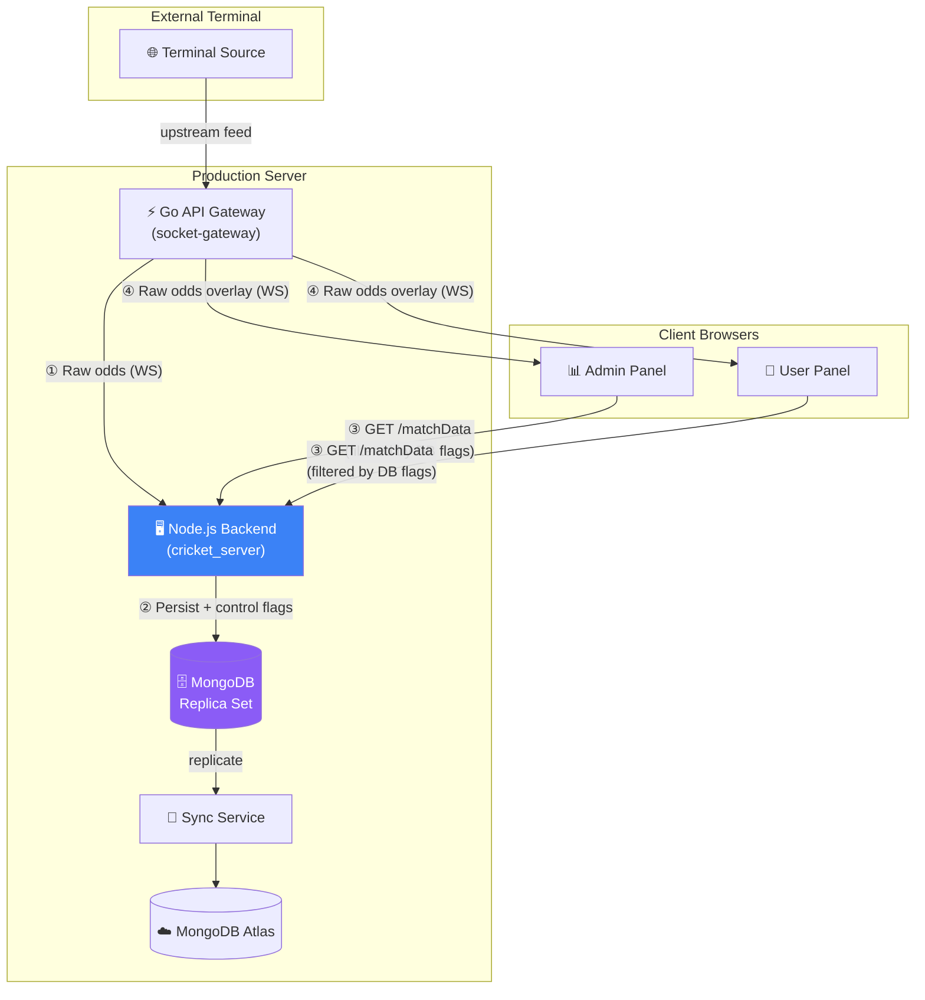
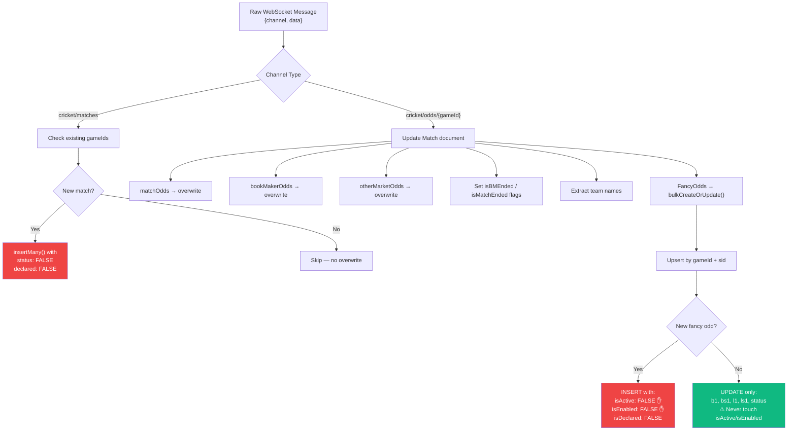
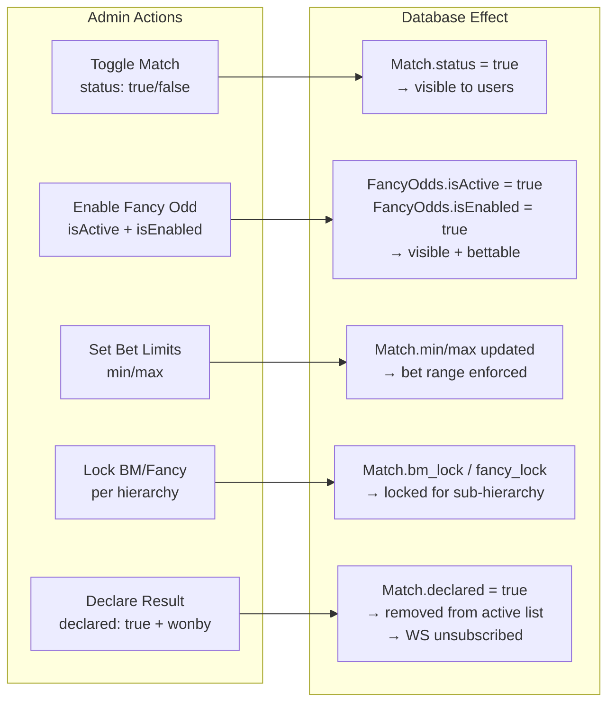
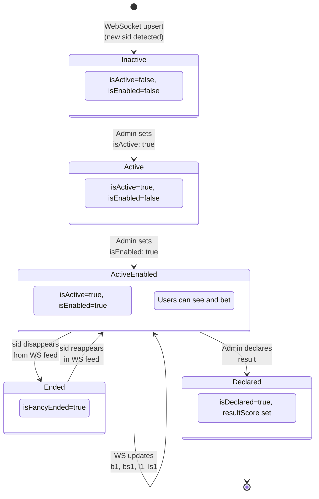
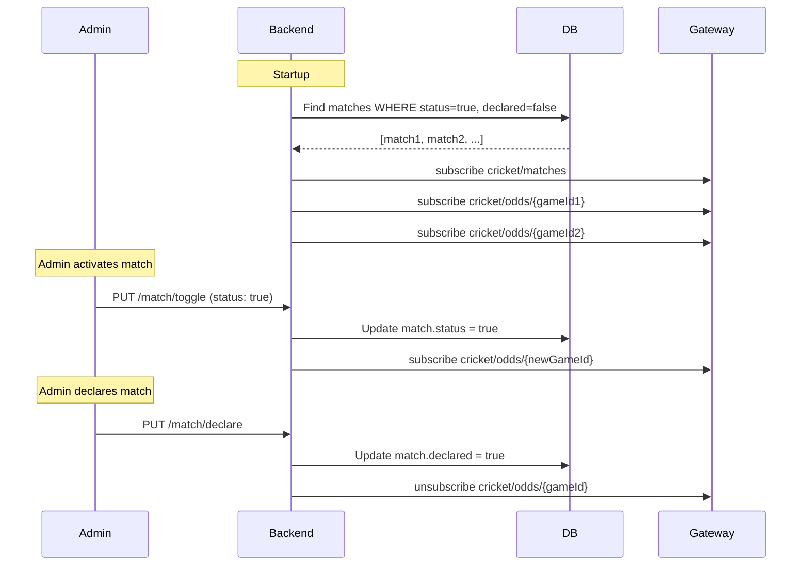
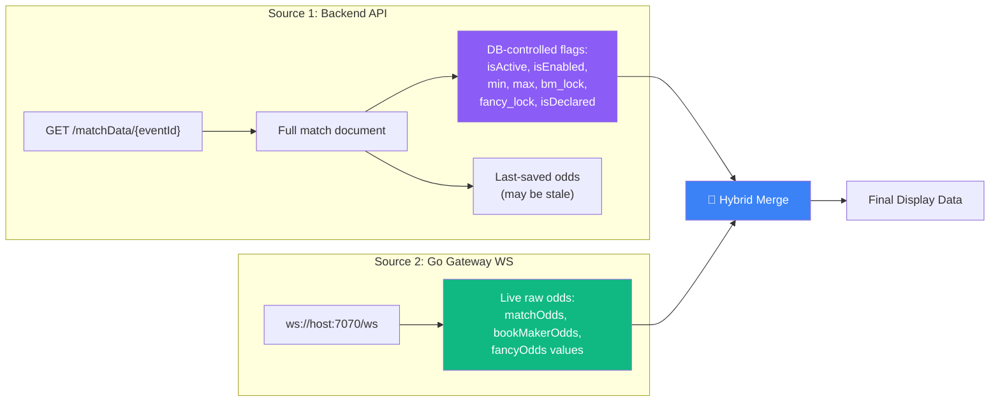

# Production Architecture — WebSocket Data Control & Optimization

> How the backend controls data flow, how admin/user see only controlled data, and how to optimize the system

**Client integration (REST + Socket.IO auth, events, examples):** see [`docs/CLIENT_INTEGRATION.md`](docs/CLIENT_INTEGRATION.md).

---

## 1. Production System Overview



### The 4-Step Data Life Cycle

| Step | What Happens | Who Controls |
|------|-------------|--------------|
| **①** Raw data arrives from terminal via WebSocket | Go Gateway receives and distributes | Terminal / Go Gateway |
| **②** Backend persists to MongoDB with control flags | [TerminalSocketClient](file:///root/cricket/server/src/services/terminalSocketClient.ts#18-405) writes, admin controls flags | **Backend (automatic)** |
| **③** API serves filtered data based on DB flags | Only `isActive`, `isEnabled`, undeclared matches returned | **Admin (manual control)** |
| **④** Browser overlays raw WS odds onto API-controlled data | Numeric values only — DB flags preserved | **Frontend (automatic)** |

---

## 2. Backend Data Control Pipeline

### 2.1 What the Backend Does With Raw WebSocket Data



> [!IMPORTANT]
> **New matches start with `status: false`** — invisible to users until admin activates.
> **New fancy odds start with `isActive: false, isEnabled: false`** — invisible until admin enables.
> The WebSocket data flow **never overwrites admin-controlled flags**.

### 2.2 What the Backend NEVER Overwrites

These fields are **exclusively controlled by admin actions** (via API endpoints), never by WebSocket data:

**Match Document:**
| Field | Purpose | Default | Changed By |
|-------|---------|---------|------------|
| `status` | Is match visible/active | `false` | Admin toggle |
| `declared` | Is match result declared | `false` | Admin declare action |
| `wonby` | Winner team name | `null` | Admin declaration |
| [min](file:///root/cricket/admin/src/hooks/useTerminalSocket.ts#25-145) / `max` | Bet amount limits | `500` / `50000` | Admin settings |
| `bet_delay` | Delay before bet acceptance | `3` | Admin settings |
| `bm_lock` | BookMaker lock per admin hierarchy | `[]` | Admin lock toggle |
| `fancy_lock` | Fancy lock per admin hierarchy | `[]` | Admin lock toggle |

**FancyOdds Document:**
| Field | Purpose | Default | Changed By |
|-------|---------|---------|------------|
| `isActive` | Show in user panel | `false` | Admin activate |
| `isEnabled` | Allow betting on it | `false` | Admin enable |
| `isDeclared` | Result declared | `false` | Admin/auto declare |
| `resultScore` | Declared result | `null` | Admin/auto declare |
| [min](file:///root/cricket/admin/src/hooks/useTerminalSocket.ts#25-145) / `max` | Bet limits for this fancy | `100` / `25000` | Admin settings |

### 2.3 Backend — What Gets Updated by WebSocket

Only **raw odds values** are overwritten on each message:

```
Match.matchOdds       ← full overwrite from WS
Match.bookMakerOdds   ← full overwrite from WS
Match.otherMarketOdds ← full overwrite from WS
Match.isBMEnded       ← derived (true if bookMakerOdds is empty)
Match.isMatchEnded    ← derived (true if matchOdds is empty)
Match.teams           ← extracted from odds data

FancyOdds.b1, bs1, l1, ls1  ← updated per sid
FancyOdds.status             ← updated per sid
FancyOdds.isFancyEnded       ← derived (true if sid missing from feed)
```

---

## 3. Admin Panel — Data Control Layer

### 3.1 Admin Controls Flow



### 3.2 What Admin Sees vs What User Sees

**Admin API** ([getAllMatchById](file:///root/cricket/server/src/services/match.service.ts#165-257)) — sees ALL data including inactive:
```javascript
// Admin query — no isActive/isEnabled filter on fancyOdds
$match: { isActive: true }  // Only filter: isActive
// Admin can see disabled odds to enable them
```

**User API** ([getMatchById](file:///root/cricket/server/src/services/match.service.ts#70-164)) — sees ONLY controlled data:
```javascript
// User query — strict filtering
$match: {
  eventId,
  declared: { $eq: false }  // Only undeclared matches
}
// FancyOdds filtered by:
$match: {
  isActive: true,   // Must be activated by admin
  isEnabled: true    // Must be enabled by admin
}
```

### 3.3 Data Visibility Matrix

| Data | Admin Panel | User Panel | Controlled By |
|------|:-----------:|:----------:|---------------|
| Match with `status: false` | ✅ | ❌ | Admin toggle |
| Match with `declared: true` | ✅ | ❌ | Auto-hidden |
| FancyOdd with `isActive: false` | ✅ (can activate) | ❌ | Admin activate |
| FancyOdd with `isEnabled: false` | ✅ (can enable) | ❌ | Admin enable |
| FancyOdd with `isDeclared: true` | ✅ | ❌ (hidden from active) | Admin/auto |
| BookMaker odds when `bm_lock` includes hierarchy admin | ✅ | 🔒 Locked | Admin lock |
| Fancy odds when `fancy_lock` includes hierarchy admin | ✅ | 🔒 Locked | Admin lock |
| Live odds values (b1, l1, etc.) | ✅ Real-time via WS | ✅ Real-time via WS | Terminal (auto) |

---

## 4. Database Management with WebSocket

### 4.1 FancyOdds State Machine



### 4.2 bulkCreateOrUpdate Strategy

The `FancyOddsService.bulkCreateOrUpdate()` uses MongoDB `bulkWrite` with upserts:

```
For each incoming fancy odd (identified by gameId + sid):
  ┌─ If document EXISTS in DB:
  │   └─ $set ONLY: b1, bs1, l1, ls1, status  (numeric values)
  │   └─ PRESERVE: isActive, isEnabled, isDeclared, min, max  (admin flags)
  │
  └─ If document DOES NOT EXIST:
      └─ $setOnInsert: all fields with safe defaults
          isActive: false
          isEnabled: false
          isDeclared: false
          min: 100, max: 25000
```

After upserts, sids that existed in DB but NOT in the incoming WS data are marked `isFancyEnded: true`.

### 4.3 Match Subscription Lifecycle



---

## 5. Frontend Hybrid Merge — Controlled Data + Live Odds

### 5.1 The Two Data Sources



### 5.2 Merge Rules

| Field | Source | Reason |
|-------|--------|--------|
| `match.status` | API (DB) | Admin-controlled |
| `match.declared` | API (DB) | Admin-controlled |
| `match.min / max` | API (DB) | Admin-set limits |
| `match.bm_lock` | API (DB) | Admin hierarchy lock |
| `match.matchOdds` | **WS overlay** | Real-time display |
| `match.bookMakerOdds` | **WS overlay** | Real-time display |
| `fancyOdds.isActive` | API (DB) | Admin-controlled |
| `fancyOdds.isEnabled` | API (DB) | Admin-controlled |
| `fancyOdds.b1, bs1, l1, ls1` | **WS overlay** (merged by `sid`) | Real-time values |
| `fancyOdds.min / max` | API (DB) | Admin-set limits |

### 5.3 Why This Hybrid Approach?

1. **Security** — Users can't bypass admin controls by reading raw WS data, because the API only returns `isActive: true, isEnabled: true` fancy odds
2. **Freshness** — Live odds update in real-time without re-fetching the full API
3. **Consistency** — DB flags from the initial API call are never lost or overwritten by WS data
4. **Efficiency** — Single API call at page load + continuous WS stream (no polling)

---

## 6. Optimization Strategies

### 6.1 Database Indexing

**Match Collection** — 8 compound indexes for sub-150ms queries:
```
{ eventId: 1 }                    ← Primary lookup (unique)
{ gameId: 1 }                     ← Secondary lookup
{ status: 1, eventTime: 1 }      ← Active match filtering
{ status: 1, inPlay: 1, eventTime: 1 }  ← Live match queries
{ eventId: 1, declared: 1 }      ← Hinted aggregation queries
```

**FancyOdds Collection** — 7 indexes:
```
{ gameId: 1, sid: 1 }            ← Unique compound (prevents duplicates)
{ gameId: 1, isActive: 1, isEnabled: 1 }  ← Aggregation pipeline filter
{ gameId: 1, isActive: 1 }       ← Fast active filtering
```

### 6.2 Query Optimization

- **Lean queries** (`.lean()`) — returns plain JS objects, ~5x faster than hydrated Mongoose docs
- **Projection** — only select needed fields, reduces data transfer
- **Aggregation hints** (`hint: { eventId: 1 }`) — forces optimal index usage
- **Query timeout** (`maxTimeMS: 100`) — prevents slow queries from blocking
- **Limit** (`$limit: 5000` on fancyOdds) — prevents unbounded payloads

### 6.3 WebSocket Optimization

**Backend ([TerminalSocketClient](file:///root/cricket/server/src/services/terminalSocketClient.ts#18-405)):**
- `bulkWrite({ ordered: false })` — parallel upserts, ignores individual failures
- Reconnect with exponential backoff (1s → 30s) — prevents server hammering
- Only subscribes to active matches — minimizes message volume
- Auto-unsubscribes declared matches — reduces load over time

**Frontend ([useTerminalSocket](file:///root/cricket/admin/src/hooks/useTerminalSocket.ts#25-145)):**
- Single shared WebSocket per page — multiple components subscribe to same connection
- `useRef` for WebSocket instance — avoids re-renders
- Channel data in `useState` with object spread — React batches updates
- Auto re-subscribe on reconnect — seamless recovery
- Reconnect backoff (1s → 15s) — prevents browser CPU waste

### 6.4 Memory Management

- Log entries capped at 500 in demo dashboard
- FancyOdds `$limit: 5000` per match query
- Backend only tracks `activeMatchGameIds` Map — cleaned up on unsubscribe
- Frontend `useEffect` cleanup closes WS on unmount — prevents memory leaks

---

## 7. Production Deployment

### 7.1 Environment Variables

**Backend** — no WS env var needed, URL is hardcoded to `wss://socket.hpterminal.com/ws`

**Admin/User [env.production](file:///root/cricket/user/.env.production):**
```env
# For local/staging — connect to local Go gateway
VITE_TERMINAL_WS_URL=ws://192.168.0.142:7070/ws

# For production — connect to production gateway
VITE_TERMINAL_WS_URL=wss://socket.yourdomain.com/ws
```

If `VITE_TERMINAL_WS_URL` is not set, the hook auto-derives from `window.location.hostname:7070` at runtime.

### 7.2 Production Checklist

- [ ] Go API Gateway deployed and accessible
- [ ] Backend can reach `wss://socket.hpterminal.com/ws`
- [ ] MongoDB replica set healthy with indexes created
- [ ] `VITE_TERMINAL_WS_URL` set in both [.env.production](file:///root/cricket/user/.env.production) files
- [ ] Docker images rebuilt with production env vars
- [ ] Admin activates matches (`status: true`)
- [ ] Admin enables fancy odds (`isActive: true, isEnabled: true`)
- [ ] Verify backend logs: `[TerminalSocket] Connected`, `Subscribed to cricket/matches`
- [ ] Verify browser DevTools: WS tab shows connection + subscribe/message frames
- [ ] Verify user panel: live odds update without page refresh

---
## 8. End-to-end flow (Terminal WS → Mongo → cache → Socket.IO)

1. **`TerminalSocketClient`** connects to `TERMINAL_WS_URL`, subscribes to `cricket/matches`, then to `cricket/odds/{gameId}` for each **active** match (`status: true`, `declared: false`).
2. **`cricket/matches`** — payloads may be `{ data: [...] }`, `{ data: { data: [...] } }`, or `{ data: { matches: [...] } }` etc. The server **`extractMatchArrayFromTerminal`** normalizes this before **`insertMany`** (default **`status: false`**). Rows are **sanitized** (string `gameId`/`eventId`, required field defaults) so validation matches the dashboard feed. After insert, **`subscribeToMatch(gameId)`** runs for each new row.
3. **`cricket/odds/{gameId}`** — if a row exists with **`status: true`** and **`declared: false`**, odds are written to Mongo (`matchOdds`, `bookMakerOdds`, fancy bulk upsert, etc.).
4. **`scheduleMatchRebuildAndEmit(eventId)`** (debounced ~80ms) calls **`matchCache.rebuildFromUltraFast(eventId)`** (persists the UltraFast JSON to **Redis**: `cricket:match:uf:{eventId}` and `cricket:match:gid:{gameId}`) then **`socketService.emitMatchUpdate(eventId, payload)`** → clients in room **`match:${eventId}`** get **`match:update`**. With multiple Node processes, **`@socket.io/redis-adapter`** on the same **`REDIS_URL`** fans out emits across replicas.
5. **Gates** — Odds are **ignored** until the match is **active** in DB. **`match:join`** / cache only serve **active, undeclared** matches. **`toggleMatch`** subscribes/unsubscribes odds and updates cache + Socket.IO when status flips.

Debug: `GET /monitoring/websocket` → `inboundMessageCount`, `lastInbound`. Env **`TERMINAL_WS_TRACE=true`** logs every inbound frame.

---
## 9. Socket.IO Event Contract (Match Updates)

### 9.1 Authentication (required)

Connections are rejected if no valid JWT is provided (same rules as REST **`adminOrUserMiddleware`**):

| Source | Notes |
|--------|--------|
| **`handshake.auth.token`** | Recommended for SPAs and mobile (`io(url, { auth: { token: '<JWT>' } })`). |
| **`Authorization` cookie** | Same cookie name as REST; use browser **`withCredentials: true`** and an allowed CORS origin. |
| **`Authorization: Bearer …` header** | On the Engine.IO handshake request, if your client sends it. |
| **`token` header** | Raw JWT in a header named `token` (e.g. Postman). |

**Admin:** JWT signed with **`ADMIN_SECRET_KEY`**, admin must exist and **`status: true`**.  
**User:** JWT signed with **`APP_SECRET_KEY`**, **`sessionToken`** in the payload must match **`user.session_token`** (session invalidation parity with REST).

### 9.2 Redis-backed match cache

| Key | Value |
|-----|--------|
| `cricket:match:uf:{eventId}` | JSON string — full UltraFast payload (same shape as in-memory cache before). |
| `cricket:match:gid:{gameId}` | `eventId` string for resolving `gameId` on `match:join`. |

**`REDIS_URL`** must be set (e.g. `redis://redis:6379` in Docker Compose, `redis://127.0.0.1:6379` when Node runs on the host). No TTL by default; entries are removed when matches are toggled off, declared, or rebuild returns inactive data.

### 9.3 `@socket.io/redis-adapter` (horizontal scale)

The server uses the **`redis`** package (v4) **pub** + **sub** clients on **`REDIS_URL`** with **`@socket.io/redis-adapter`**. This is separate from **`ioredis`** used for match-cache reads/writes, but both use the **same Redis instance**. With **two or more Node replicas**, clients on replica A still receive **`match:update`** emitted on replica B when both share Redis.

### 9.4 Socket Rooms
- Room name: `match:${matchId}`
- `matchId` here is the same as your REST `GET /api/v1/match/:matchId` parameter (internally treated as `eventId`).

### 9.5 Client -> Server
- Event: `match:join`
  - Payload: `{ matchId: string }` **or** `{ gameId: string }` (either id), or the same JSON **as a string** (Postman often sends string bodies — the server parses both).
  - Server resolves **eventId or gameId** against MongoDB, rebuilds cache if needed, joins room `match:${eventId}`, then emits `match:update`.

### 9.6 Server -> Client
- Event: `match:update`
  - Payload: full UltraFast payload (same shape as `UltraFastMatchService.getMatchByIdUltraFast`)
- Event: `match:error`
  - Payload: `{ matchId: string | null, reason: string, hint?: string }`
  - Reasons: `missing_matchId` | `not_found` | `match_inactive` | `payload_unavailable` | (join failures may surface other messages)
- Event: `match:declared`
  - Payload: `{ matchId: string }`
